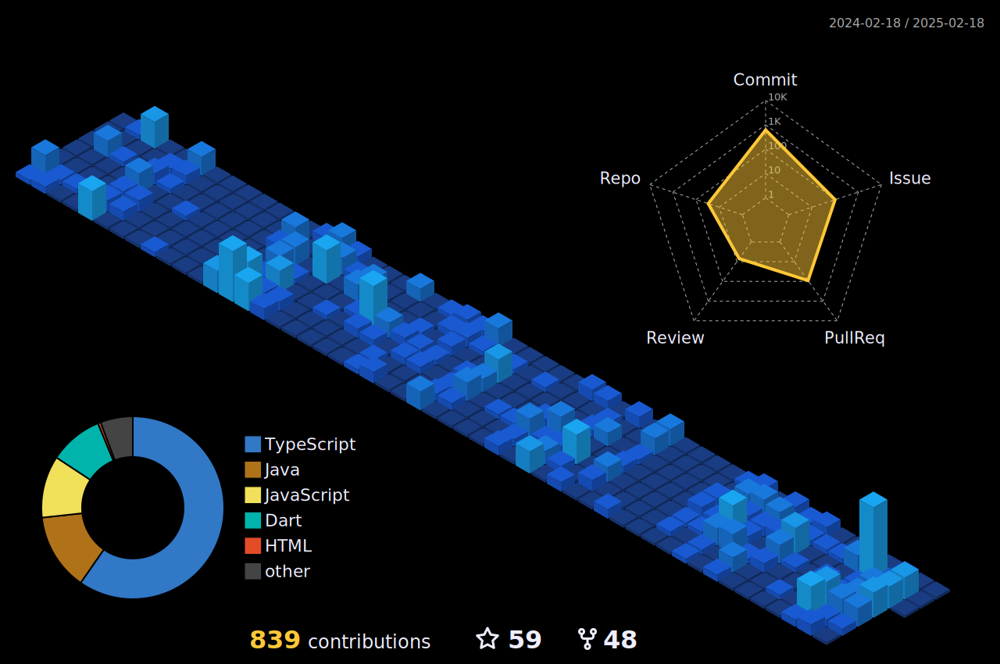

<!-- Header icons -->

 <!-- Day and Night icons -->
  

  

<h1> Hello, I am Avishka </h1>

<picture>
    <source media="(prefers-color-scheme: light)" srcset="https://images.squarespace-cdn.com/content/v1/5c4ece0e3917ee277d32eaf3/1570273077298-30G7YE5PFHJW058FFNNJ/summer-ani.gif" align="right" width="30%">
    
 </picture>

<!--   About me -->
* ☁️ Cloud enthusiast | 🐧 Linux lover | 🌩️ AWS explorer.   
* 💻 Building full-stack dreams, one line at a time.  
* 🚀 Turning curiosity into code and challenges into growth.  
* 🎨 Linux ricing and system tweaks fuel my creativity.  
* 🌟 Code. Tinker. Repeat.

<!-- Programming languages -->
<h2>I've worked with</h2>

<!-- Profile summary -->
<h2>Profile summary </h2>

 <picture align = "left">
     
  </picture>
<picture align = "left">
     
</picture>
  <picture align = "right">
    <source media="(prefers-color-scheme: light)" srcset="images/profile-custom-season.svg" width = "98%">
    
  </picture>

 

<h2>Achievements 🏆</h2>

<!-- Resources -->
<!-- GitHub Stats: https://github.com/anuraghazra/github-readme-stats -->
